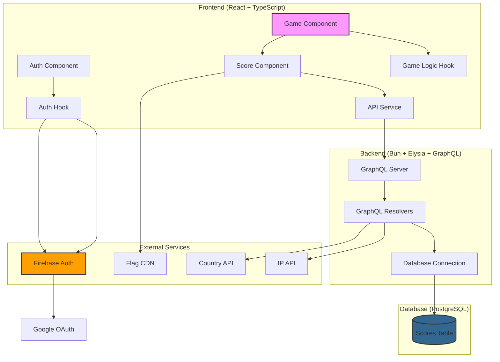
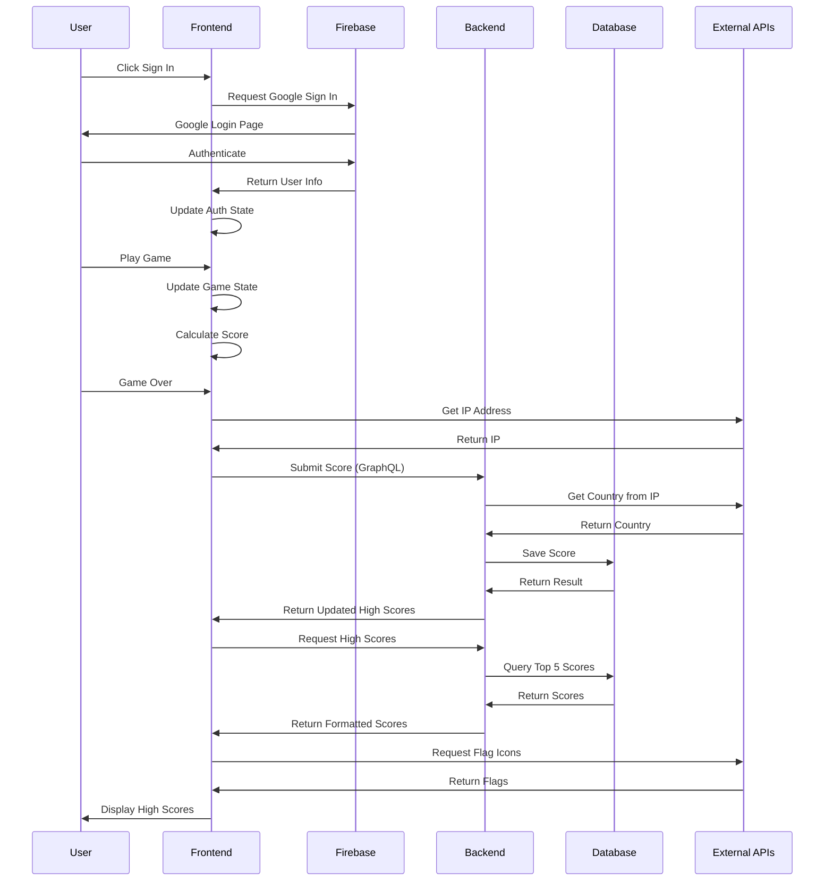

# tetris-game

docker-compose up --build -d


## 1. หลักการพัฒนา
### A. การจัดโครงสร้างโปรเจค (Project Structure)
```plaintext
tetris-game/                      # Root directory
│
├── frontend/                     # Frontend application
│   ├── src/
│   │   ├── components/           # React components
│   │   │   ├── GameBoard.tsx     # แสดงบอร์ดเกม
│   │   │   ├── HighScores.tsx    # แสดงคะแนนสูงสุด
│   │   │   ├── NextPiece.tsx     # แสดงบล็อกถัดไป
│   │   │   ├── ScoreModal.tsx    # Modal บันทึกคะแนน
│   │   │   └── Auth.tsx          # ระบบ Google Sign-in
│   │   │
│   │   ├── hooks/                # Custom React hooks
│   │   │   ├── useGameLogic.ts   # Game mechanics
│   │   │   └── useAuth.ts        # Authentication logic
│   │   │
│   │   ├── services/             # External services
│   │   │   └── api.ts            # GraphQL client
│   │   │
│   │   ├── config/               # Configurations
│   │   │   └── firebase.ts       # Firebase setup
│   │   │
│   │   ├── types.ts              # TypeScript types
│   │   ├── constants.ts          # Game constants
│   │   ├── App.tsx               # Main component
│   │   └── main.tsx              # Entry point
│   │
│   ├── .env                      # Environment variables
│   ├── index.html                # HTML template
│   ├── package.json              # Frontend dependencies
│   ├── tsconfig.json             # TypeScript config
│   └── vite.config.ts            # Vite configuration
│
├── backend/                      # Backend application
│   ├── src/
│   │   ├── index.ts              # Main entry & GraphQL server
│   │   └── db.ts                 # Database connection
│   │
│   ├── package.json              # Backend dependencies
│   └── tsconfig.json             # TypeScript config
│
└── docker-compose.yml            # Docker composition
```
### B. System Architecture Diagram



### C. Main Flow Sequence Diagram


## 2. API ที่สำคัญ
  
## 3. วิธี Deploy

## 4. About
<a href="https://grad.dpu.ac.th/" target="_blank">
    
</a>
<a href="https://cite.dpu.ac.th/" target="_blank">
    
</a><br><br>
Source Code นี้เป็นส่วนหนึ่งของวิชา CT648 - วิศวกรรมเว็บและคลาวด์<br>
หลักสูตรวิศวกรรมศาสตรมหาบัณฑิต สาขาวิศวกรรมคอมพิวเตอร์<br>
วิทยาลัยวิศวกรรมศาสตร์และเทคโนโลยี มหาวิทยาลัยธุรกิจบัณฑิตย์<br>
นักศึกษา: ณัฐนนท์ แสงจันทร์ ID: 66130537<br>
<a href="https://cite.dpu.ac.th/ct/master-ct/research_chaiyaporn.html">
    
</a><br>
อาจารย์ที่ปรีกษา: ผู้ช่วยศาสตราจารย์ ดร.ชัยพร เขมะภาตะพันธ์<br>

